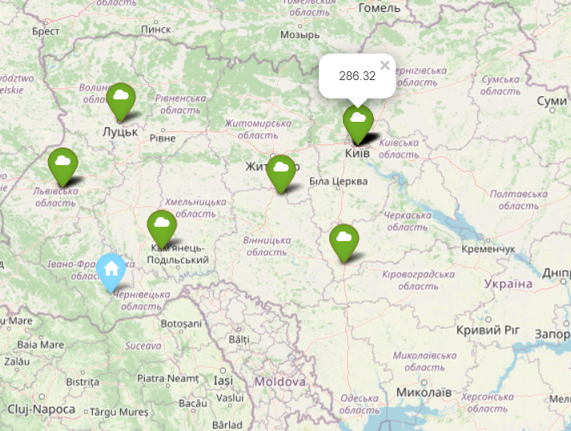

## MAP APP
To use this project - run main.py
##### Usage
The purpose of the program is to generate a map according to the data, that user enters. In conclusion, user gets the map with 3 layers.
##### First layer
is a marker, which shows, where user is.

##### Second layer
markers, which show up to 10 places, where some films where shot. (nearest to the user). By clicking on the certain marker you get the movie title. 

##### Third layer
markers show distance from user to the place, marked by the certain marker.

From 3 layers user can change what to show on his map, which is generated as html file.